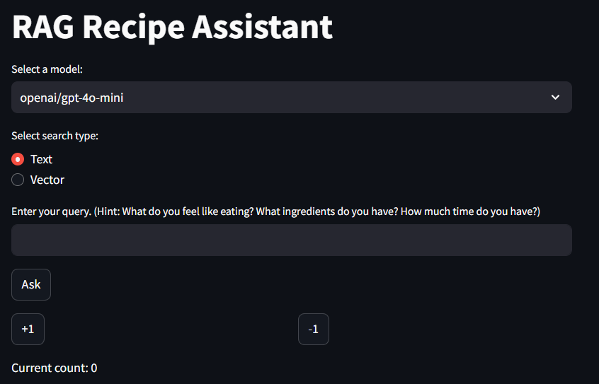
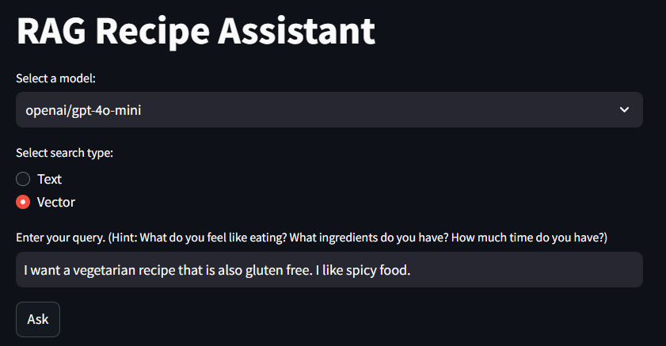
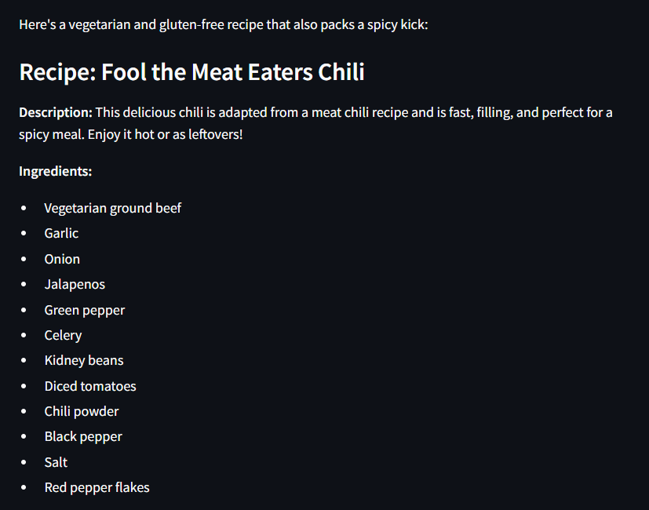
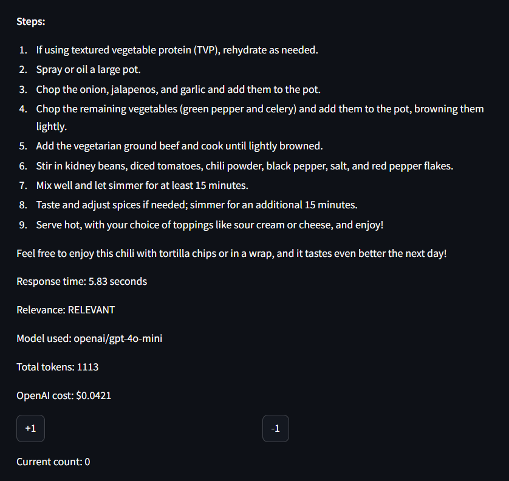

# RAG Recipe Assistant

## Overview
RAG Recipe Assistant is a Streamlit web application designed to assist users in finding recipes based on their queries. It leverages various language models to generate recipe recommendations and provides a feedback mechanism to improve its responses over time. The feedback stats are recorded in a Postgres database and used for a dashboard in grafana. 

### Streamlit App UI


### Grafana Dashboard


## Features
- Model Selection: Choose from different language models to process your queries.
- Search Type: Select between text-based or vector-based search methods.
- Real-Time Query Processing: Enter your query to get recipe suggestions in real-time.
- Response Information: View details about the response time, relevance, model used, and cost (for OpenAI models).
- Feedback System: Provide positive or negative feedback to improve the assistant.
- Conversation History: Review recent conversations and filter them based on relevance.
- Feedback Statistics: View overall feedback statistics for the application.

## Example input/output:





## Installation

1. Clone the repository
```bashrc
git clone https://github.com/zstankow/ollama-FAQ-assistant.git
```
2. Navigate to the directory
```bashrc
cd recipe-recommendation-system/app
```
3. Download the dataset
```bashrc
curl -L -o recipes.json https://github.com/zstankow/recipe-recommendation-system/releases/download/recipes/recipes.json
```

4. Build and run the Docker containers
```bashrc
docker-compose build streamlit
docker-compose up
```

5. In a separate terminal navigate to the directory and run
`python prep.py`
This will initialize the postgres database.

6. To use the phi3 model, navigate to directory in a new bash terminal
```bashrc
docker exec -it ollama bash
```
```bashrc
ollama pull phi3
```

This downloads the phi3 model if you choose to use ollama with CPU instead of outsourcing to an OpenAI model. 

7. To open the app, paste in url `http://localhost:8501/`


